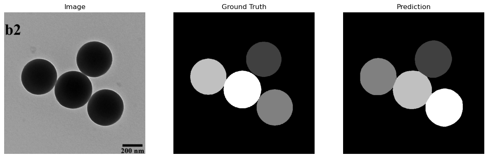
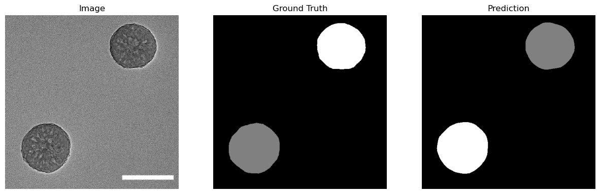
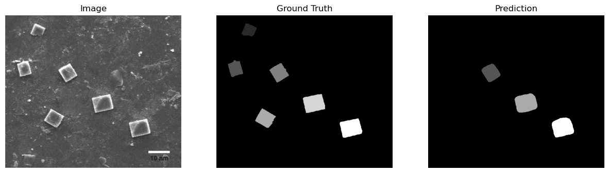
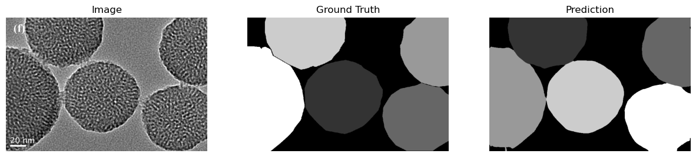
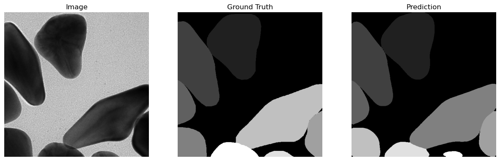

```python
import os
from cellpose import models, train
from sklearn.model_selection import train_test_split
from PIL import Image
import numpy as np
import matplotlib.pyplot as plt

def load_data(images_dir, masks_dir):
    images = os.listdir(images_dir)
    img_paths = [os.path.join(images_dir, img) for img in images]
    mask_paths = [os.path.join(masks_dir, img) for img in images]
    return img_paths, mask_paths

def prepare_data(images_dir, masks_dir, test_size=0.2):
    img_paths, mask_paths = load_data(images_dir, masks_dir)

    images = [np.array(Image.open(file).convert("RGB")) for file in img_paths]
    masks = [np.array(Image.open(file).convert("L")) for file in mask_paths]  # single-channel mask
    
    return images, masks


if __name__ == '__main__':

    images_dir = "images"
    masks_dir = "segmaps"
    
    # Prepare data_
    imgs, ground_Truth = prepare_data(images_dir, masks_dir)
    model = models.CellposeModel(model_type="models/segmentEMPD.pth")
    predictions, flows, styles = model.eval(imgs, channels=[1,2])
```


```python
import matplotlib.pyplot as plt
for images, masks, pred in zip(imgs, ground_Truth, predictions):

    # Display the image, ground truth mask, and prediction
    fig, ax = plt.subplots(1, 3, figsize=(15, 5))
    ax[0].imshow(images, cmap="gray")
    ax[0].set_title("Image")
    ax[0].axis("off")
    
    ax[1].imshow(masks, cmap="gray")
    ax[1].set_title("Ground Truth")
    ax[1].axis("off")
    
    ax[2].imshow(pred, cmap="gray")
    ax[2].set_title("Prediction")
    ax[2].axis("off")
    
    plt.show()
```

## Segmentation with diameter=30


    


    

    


    

    


    

    


    

    


    

    


    

    


    

    


    

    


    

    


    

    


    

    


    

    


    

    


    

    


    

    


    

    


    

    


    

    


    

    


